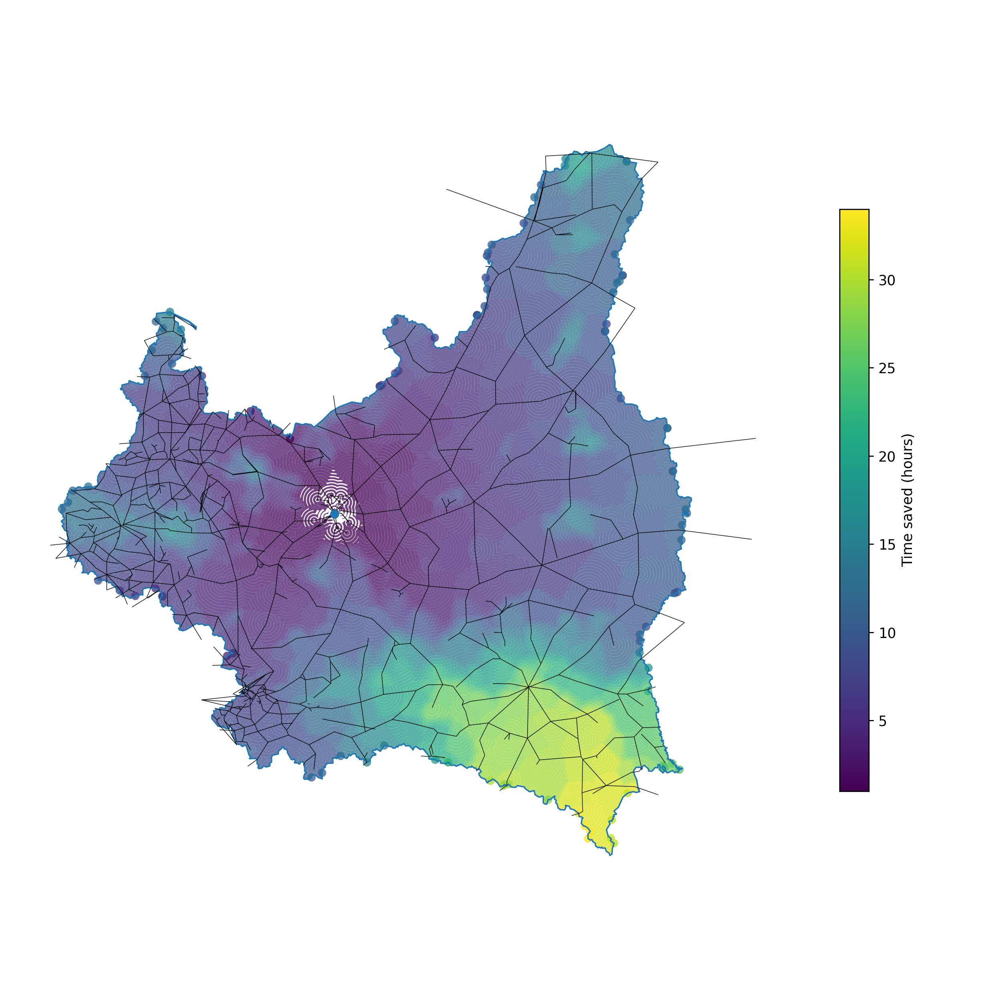

# railway_history_pl_1842_1939
An event-based railway history database verified against historical sources with simple scripts to construct a rootable railway network graph and plot basic insights.


*Figure 1. Railway network in 1877. The map shows the spatial extent of railway lines operating in 1877, reconstructed from historical line opening and closure data.*



*Figure 2. Estimated travel-time savings to Warsaw in 1939 relative to 1913, computed on the routable railway network. Colors indicate reduction in travel time (hours).*

## How to run
The only necessary files to reconstruct all the files in the `data_preprocessed` and `output` folders are the files in the `data` folder.

To run the default pipeline and generate all the files:

```bash
python scripts/run_pipeline.py
```

## Speed assumptions used in the model

### Railway commercial speed

Average commercial railway speeds for the interwar period were adopted primarily on the basis of contemporary statistical analysis published in the professional railway press (Tuz, 1939).

Average annual commercial speeds (km/h):

| Year | Speed (km/h) |
| ---: | -----------: |
| 1928 |         14.0 |
| 1929 |         14.0 |
| 1930 |         15.0 |
| 1931 |         15.8 |
| 1932 |         16.3 |
| 1933 |         16.3 |
| 1934 |         16.1 |
| 1935 |         16.1 |
| 1936 |         16.1 |
| 1937 |         16.1 |

For years not directly covered by the source:

* **1924**: a commercial speed of **13 km/h** was assumed, reflecting the ongoing post-war reconstruction of the railway network and rolling stock.
* **1913**: a counterfactual commercial speed of **12 km/h** was assumed for modelling purposes, despite the fact that the railway network was then divided between three partitioning states.

### Horse-drawn carriage speed

The commercial speed of horse-drawn wagons transporting goods to railway stations was assumed to be **4 km/h**.
This value is consistent with contemporary military, engineering, and foreign comparative sources:

* Polish military regulations for wagon trains indicate a typical marching speed of approximately **4 km/h** for horse-drawn transport columns (Ministerstwo Spraw Wojskowych, 1930).
* Cavalry movement at the walk is consistently given as **6 km/h**, providing an upper bound for unloaded or lightly loaded horse movement (Redakcja Przeglądu Wojskowego, 1928).
* U.S. Army field regulations from the early 1920s give wagon-train marching speeds of **2.5–3.5 mph (≈4.0–5.6 km/h)** depending on road conditions and column length, with daily march distances comparable to infantry (United States War Department, 1924).

Given load, road conditions, and short operational distances typical of feeder transport to railway stations, **4 km/h** was adopted as a conservative and representative commercial speed.

---

## References (speed assumptions)

Tuz, A. (1939). *Usprawnienie ruchu i przewozów*. **Inżynier Kolejowy**, 16(1/173), Table 5.

Ministerstwo Spraw Wojskowych. (1930). *Instrukcja taborowa do użytku wszystkich broni i służb (tymczasowa). Cz. 2: Zestawienie składników taboru; Cz. 3: Używanie taboru* (p. 73). Warszawa.
Available at: [https://polona.pl/item-view/1169fc64-bac9-44c4-9114-954eacafd9a6?page=88](https://polona.pl/item-view/1169fc64-bac9-44c4-9114-954eacafd9a6?page=88)

Redakcja Przeglądu Wojskowo-Technicznego. (1928). *Polowy podręcznik saperski*. Warszawa: Drukarnia Techniczna, Sp. Akc. (Część VII, p. 6).
Available at:
[https://zbrojownia.cbw.wp.mil.pl/Content/12076/231912_CZ_7.pdf](https://zbrojownia.cbw.wp.mil.pl/Content/12076/231912_CZ_7.pdf)

United States War Department. (1924). *Field Service Regulations: United States Army* (p. 59). Washington, DC: Government Printing Office.


## References (railway history sources)

Lijewski, T. (1959). *Rozwój sieci kolejowej Polski*. Dokumentacja Geograficzna, Zeszyt 5. Polska Akademia Nauk.

Atlas Kolejowy. (n.d.). *Atlas kolejowy Polski*. https://www.atlaskolejowy.net/  
(Accessed February 28–30, 2026).

Historia sieci kolejowej. (n.d.). *Pod Semaforkiem*. https://www.pod-semaforkiem.pl/  
(Accessed November 6, 2026).

Local government websites and Wikipedia articles on railway stations were also consulted and cross-verified.

## Future work

Future work in the Central-European context should rely primarily simply on the database https://www.atlaskolejowy.net/. It is by far the best source available.
