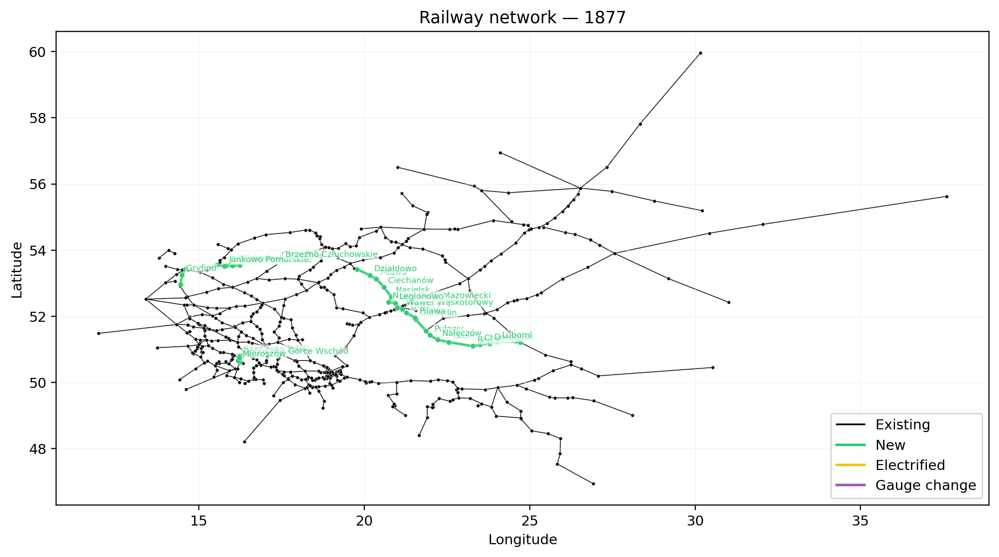
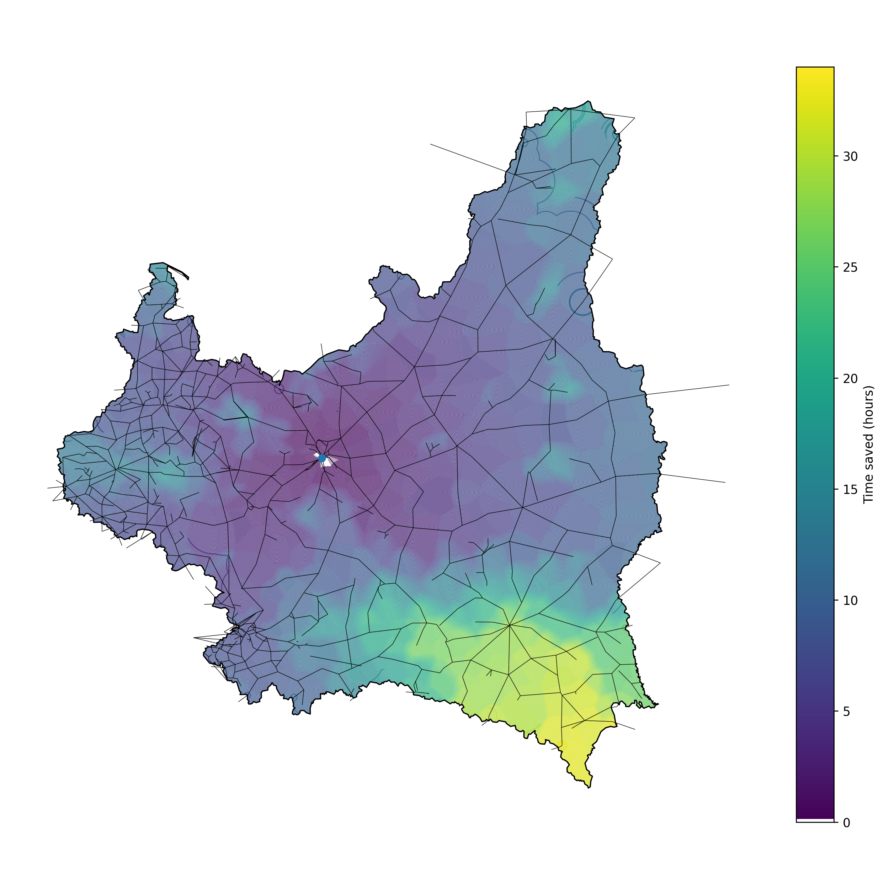

# Railway History of Poland and Second Polish Republic (1842-1939)

An event-based railway history database (verified against historical sources) with a reproducible pipeline that:
- builds historical line intervals,
- constructs routable railway networks,
- computes time and distance accessibility metrics,
- and generates timeline / isochrone / time-savings visualizations.

Acknowledgements: I strongly encourage using https://pod-semaforkiem.com.pl/ and https://www.atlaskolejowy.net/.
These are the most important online resources for Polish railway history and were crucial for building this dataset.



*Figure 1. Railway network in 1877.*



*Figure 2. Estimated travel-time savings to Warsaw in 1939 relative to 1913, computed on the routable railway network. Colors indicate reduction in travel time (hours). Assumed commercial speeds: 12 km/h (1913) and 16.1 km/h (1939).* 

## What the pipeline generates

From `data/` inputs, the pipeline regenerates:
- `data_preprocessed/`
  - `lines.csv`
  - `lines_cropped.csv`
  - district union and centroids
- `output/networks/`
  - scenario-specific routable network GeoJSON/PNG/manifest files
- `output/distance_matrices/`
  - time matrices (`distance_matrix_long_*`)
  - rail-distance matrices in km (`distance_matrix_rail_km_long_*`)
  - horse-distance matrices in km (`distance_matrix_horse_km_long_*`)
  - point-index tables and connection diagnostics
- `output/check_plots/isochrones/`
  - colored and grayscale isochrone maps + GeoJSON
- `output/check_plots/time_savings/`
  - colored and grayscale time-savings maps + GeoJSON
- `output/check_plots/built_between/`
  - railway expansion maps for selected year ranges
- `output/history_plots/` and `output/history_plots_II_RP_only/`
  - yearly timeline maps (1842-1939)

## Scenarios and years

The pipeline computes two network scenarios:
- `baseline`: historical year-specific speed assumptions
- `fixed14`: both normal and narrow gauge railway speeds fixed to `14.0 km/h`

Network builds are configured for:
- `1913, 1918, 1924, 1938, 1939` (both scenarios)

Distance matrices are configured for:
- `1913, 1918, 1924, 1938, 1939` (both scenarios)

Isochrones are configured for:
- `1913, 1918, 1924, 1939` (both scenarios)

Time-savings pairs are configured for:
- `1913->1924`
- `1913->1939`
- `1918->1939`
- `1924->1939`

Time-savings are computed with a `20-minute` step.

## How to run

Install dependencies (example):

```bash
C:\Users\janek\miniconda3\python.exe -m pip install -r requirements.txt
```

Run full pipeline:

```bash
C:\Users\janek\miniconda3\python.exe scripts/run_pipeline.py
```

Notes:
- By default, `run_pipeline.py` cleans `data_preprocessed/` and `output/` before execution.
- Use `--no-clean` to keep existing generated files.
- Use `--steps ...` or `--list-steps` for targeted runs.

## Speed assumptions used in the model

### Railway commercial speed

Average commercial railway speeds for the interwar period were adopted primarily on the basis of contemporary statistical analysis published in the professional railway press (Tuz, 1939).

Average annual commercial speeds (km/h):

| Year | Speed (km/h) |
| ---: | -----------: |
| 1928 |         14.0 |
| 1929 |         14.0 |
| 1930 |         15.0 |
| 1931 |         15.8 |
| 1932 |         16.3 |
| 1933 |         16.3 |
| 1934 |         16.1 |
| 1935 |         16.1 |
| 1936 |         16.1 |
| 1937 |         16.1 |

For years not directly covered by the source:
- `1924`: `13 km/h` (baseline assumption)
- `1913`: `12 km/h` (baseline counterfactual assumption)

The alternative scenario `fixed14` sets both normal and narrow gauge railway speeds to `14.0 km/h` in each computed year.

### Horse-drawn carriage speed

Commercial speed for horse-drawn feeder transport to stations is assumed as `4 km/h`.

## References (speed assumptions)

Tuz, A. (1939). *Usprawnienie ruchu i przewozów*. **Inżynier Kolejowy**, 16(1/173), Table 5.

Ministerstwo Spraw Wojskowych. (1930). *Instrukcja taborowa do użytku wszystkich broni i służb (tymczasowa).* Warszawa.
https://polona.pl/item-view/1169fc64-bac9-44c4-9114-954eacafd9a6?page=88

Redakcja Przeglądu Wojskowo-Technicznego. (1928). *Polowy podręcznik saperski*. Warszawa.
https://zbrojownia.cbw.wp.mil.pl/Content/12076/231912_CZ_7.pdf

United States War Department. (1924). *Field Service Regulations: United States Army*.

## References (railway history sources)

Lijewski, T. (1959). *Rozwój sieci kolejowej Polski*. Dokumentacja Geograficzna, Zeszyt 5.

Atlas Kolejowy. *Atlas kolejowy Polski*. https://www.atlaskolejowy.net/

Historia sieci kolejowej (Pod Semaforkiem). https://www.pod-semaforkiem.pl/

Local government websites and Wikipedia articles on railway stations were also consulted and cross-verified.
